# Buy Shoes Details

Previously we've completed the skeletal layout for the `buyshoes` page. In this lesson, we'll fill in the details.

+ Implement the complete design.
+ Responsive tweaks.

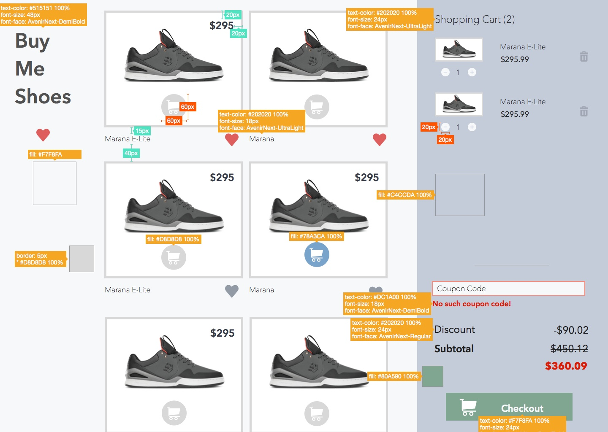

# Clone Assets

# Product Catalogue

Let's start by building the product catalogue. Since the layout is based on percentage, it should look reasonable as long as there's enough space:

<video src="products-layout-percentage-adjustable.mp4" controls autoplay loop></video>

Later we'll fix the layout problems when there isn't enough space:

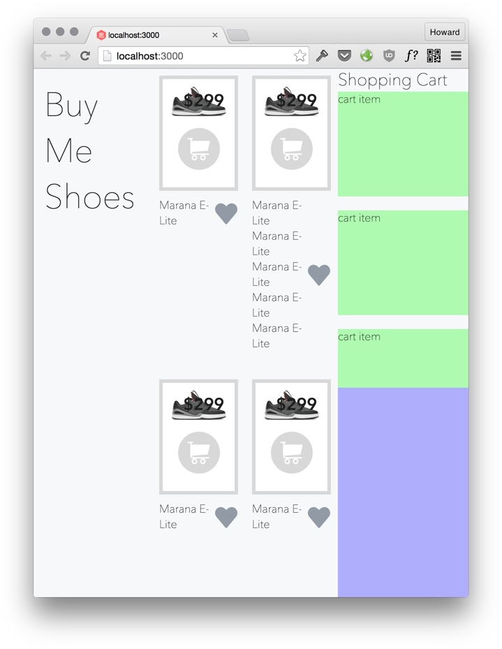

## Product Image

Let's put in the product image. The image should be as big as big as the container.


The only tricky part is to maintaining the image's aspect ratio. Our default flexbox settings would cause the image to stretch:

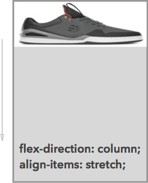

Unfortunately the image is only stretched horizontally (the cross-axis). To scale the image while maintaining the aspect ratio, give the product image an explicit width:


Since the image is set to the same width as its container, it doesn't matter whether align-items is center, flex-start, or flex-end.

Note: Why does `stretch` not maintain aspect ratio? It's because `align-self: stretch` is handled last in the flexbox layout algorithm . The algorithm (simplified) works like this:

1. Determine the intrinsic size of the original image. Use that to calculate the aspect ratio.
2. Use the width given if specified (e.g. 100%). Otherwise use the intrinsic width.
3. Scale the image's height to maintain aspect ratio.
4. Stretch the image's width to be the same as the container's width.

If `stretch` happens before step 3, then the aspect ratio would've been the same. Alas, that's not how the algorithm is designed.


### Exercise: Set The Product Image

Start with:

```html
<div class="product">
  <div class="product__display">
    
  </div>
</div> <!-- product -->
```

When using percentage layout, `margin` adds space outside the box, which would cause the boxes to exceed the available space. So they break into multiple lines like this:

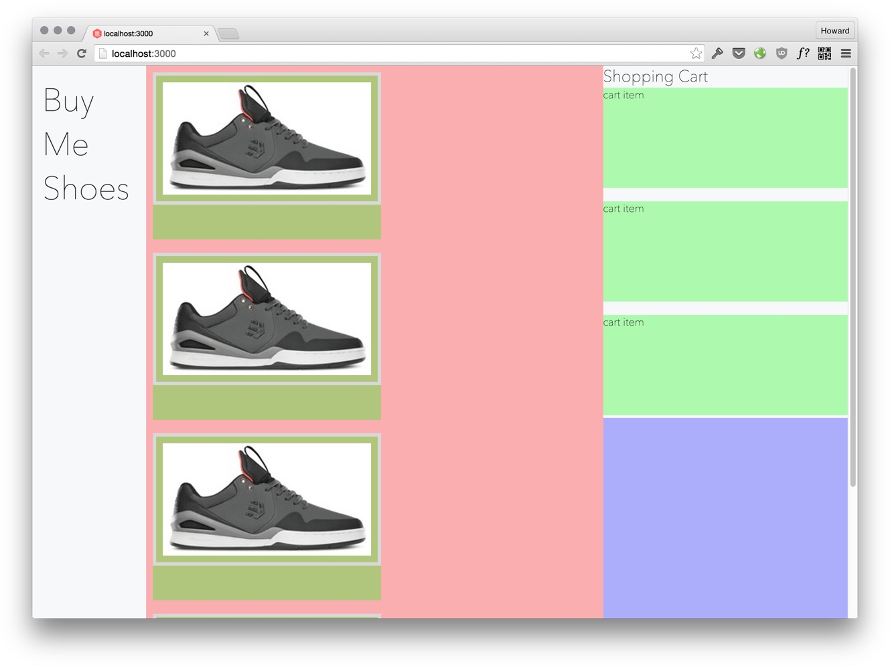

Use `padding` to add space inside the boxes to avoid this issue.

Your result:

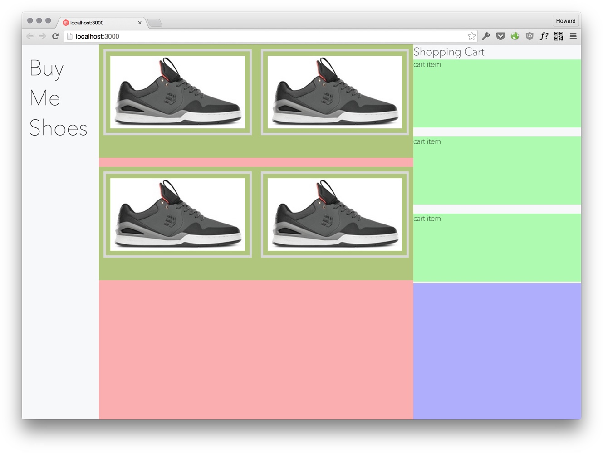

### Exercise: Add To Cart And Price

Change `product__display` to:

```html
<div class="product__display">
  
  <a class="product__add">
    
  </a>

  <div class="product__price">
    $299
  </div>
</div>
```

Note: Previously we've added an explicit height to `.product` so it acts as a placeholder. Now it's a good time to remove it.

Your result:


### Exercise: Product Name & Heart

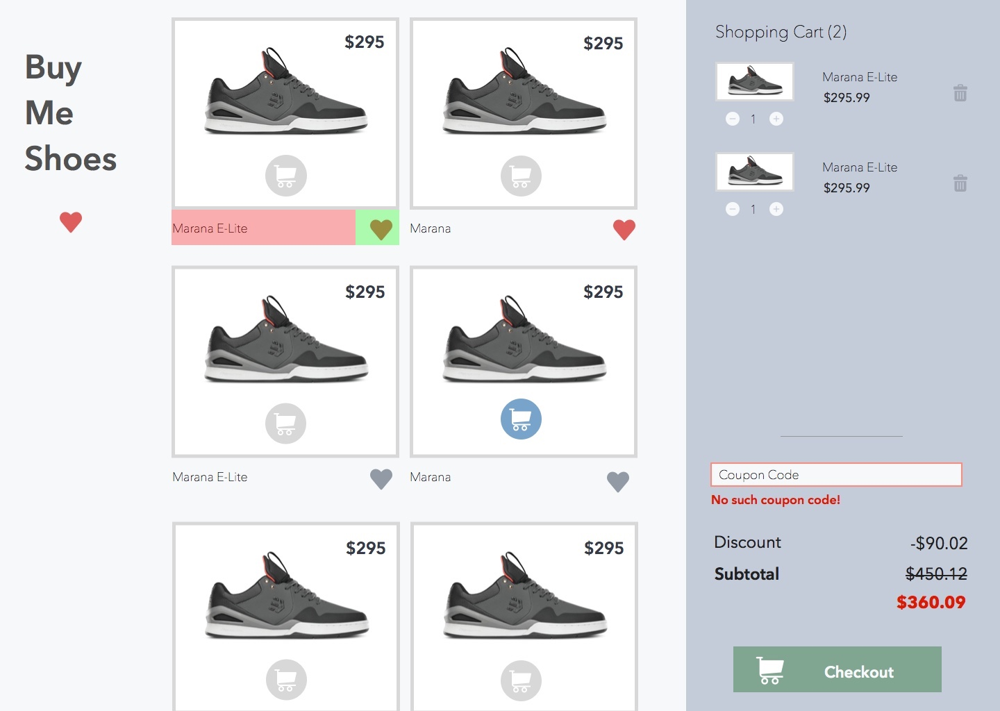

Change `.product` to:

```html
<div class="product">
  <div class="product__display">
    
    <a class="product__add">
      
    </a>

    <div class="product__price">
      $299
    </div>
  </div>

  <div class="product__description">
    <div class="product__name">
      Marana E-Lite
    </div>

    
  </div>
</div> <!-- product -->
```

It's a left/right layout, where one part should grow and the other should not. Do you remember how to do it?

Change one of the product names to be very long to test your layout is still correct.

```html
<div class="product__name">
  Marana E-Lite Marana E-Lite Marana E-Lite Marana E-Lite Marana E-Lite
</div>
```

Your result:

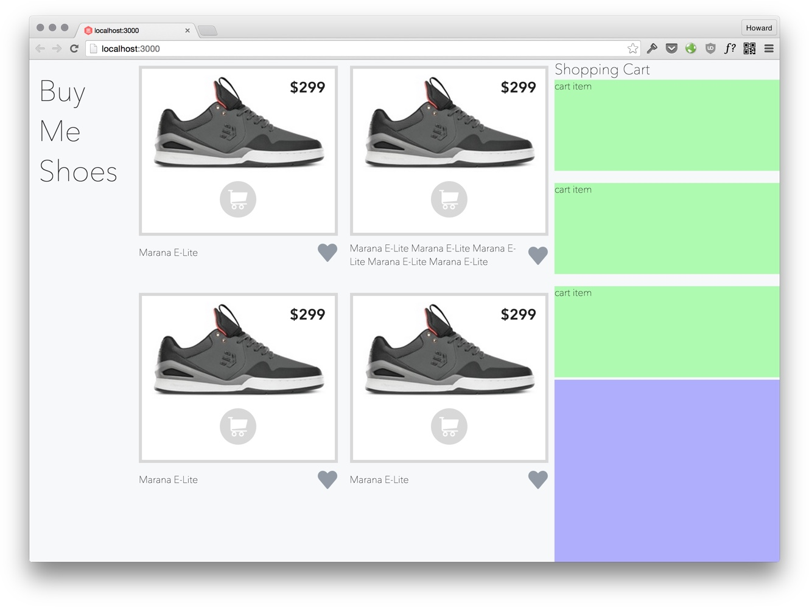

# Shopping Cart Items

Now we layout the cart items:

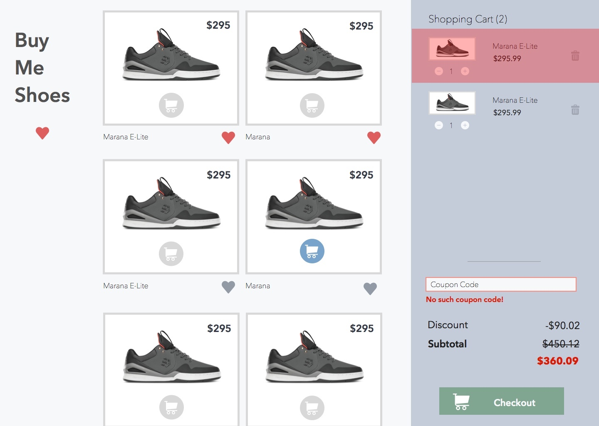

The layout strategy is like this:


+ The image should occupy `33%` of its container's width, so it becomes larger or smaller depending on the size of the screen.
+ The product name and price should grow to occupy the middle part.
+ The trash can should be just big enough.

### Exercise: Cart Items

HTML:

```html
<div class="cart-item">
  <div class="cart-item__top-part">
    <div class="cart-item__image">
      
    </div>

    <div class="cart-item__top-part__middle">
      <div class="cart-item__title">
        Marana E-Lite
      </div>

      <div class="cart-item__price">
        $299
      </div>
    </div>

    
  </div> <!-- cart-item__top-part -->


  <div class="cart-item__qty">
    <div class="adjust-qty">
      <a class="adjust-qty__button">-</a>
      <div class="adjust-qty__number">2</div>
      <a class="adjust-qty__button">+</a>
    </div>
  </div>

</div> <!-- cart-item -->
```

Your result:

<video src="cart-items.mp4" controls></video>

Make sure that the cart items can scroll under the "shopping cart" title:


# Checkout


### Exercise: Checkout Component

Nothing new here. This time, write your own HTML using the BEM convention. Start with:

```html
<div class="checkout">
  <hr class="checkout__divider"/>

  <input type="text" class="checkout__coupon-input" placeholder="coupon code"></input>

  <!-- other stuff -->

</div> <!-- checkout -->
```

There are three variants of amount in the checkout component. We can use BEM's modifier convention to name them:


+ `checkout__amount`
  + this is the base style.
+ `checkout__price--strikeout`
  + adds `text-decoration: line-through` to the base style.
+ `checkout__price--saving`
  + Change `font-weight` and `color`.

Your result:

<video src="checkout-done.mp4" controls></video>

# Responsive Tweaks

We are pretty much done. Now that all the major components are in place, it's time to start tweaking the layout for different screen sizes.

So... how do you decide what media queries to add at which screen sizes? There are basically two ways:

1. Add tweaks only for specific devices: Desktop, iPad, iPhone.
2. Continually decrease the screen size until something breaks. Fix & repeat.

The second method may seem messy, as you might end up with one tweak for screens that are smaller than 850px, another tweak for 900px or less, and yet another at 935px. In practice though, you might group them together at 900px. There is usually just 2~3 widths you'd tweak the layout. For a more nuanced responsive layout, maybe 6.

So let's start with a reasonably big window size, and start narrow it down:

<video src="responsive-checks.mp4" controls></video>

+ At 1000px it still looks ok.
+ At 950px it's looking cramped, but still ok.

At 900px it's just at the point of breaking:


At 800px, it's definitely broken:

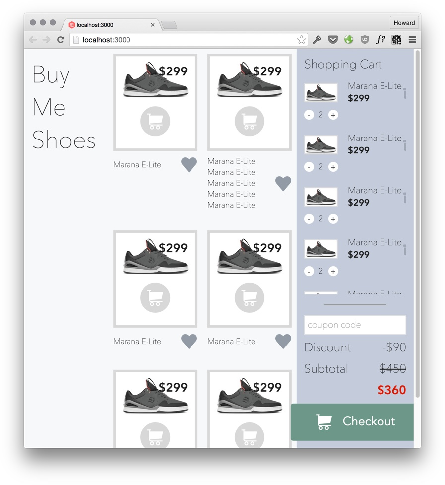

So we'd want to fix the layout between 900px and 100px. 950px is probably a good point. Your taste might differ, and you could choose a different width to add media query.

### Exercise: Tweak Sidebar Layout

At 950px, do these tweaks:

+ Increase the size of `sidebar` to `40%` of screen
+ Decrease the `site__content` to `60%` of screen.
+ Increase the size of `product` to `100%` of container, so there is one product per row.

```css
@media (max-width: 950px) {
  ...
}
```

Your result:

<video src="responsive-layout--950px.mp4" controls></video>

### Exercise: Mobile Layout

At 600px the layout breaks again:

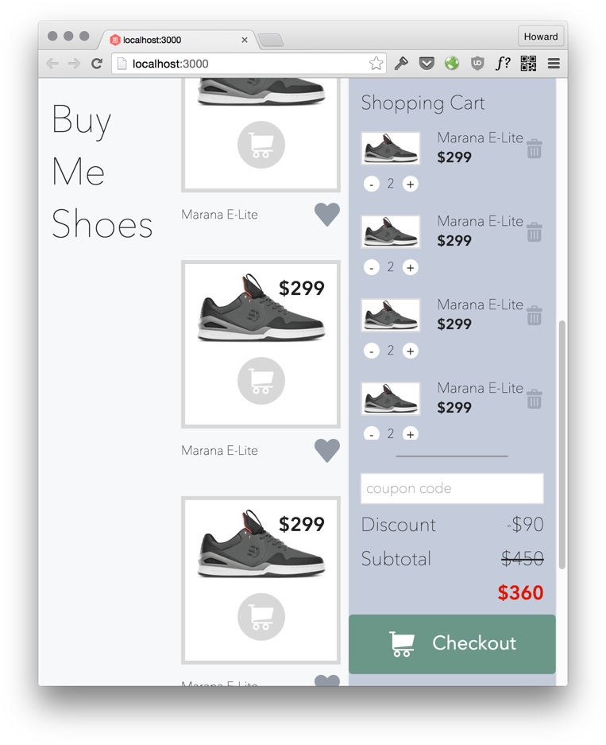

We'll apply these tweaks:

+ Increase right sidebar to `80%` of screen.
+ Hide the left sidebar.
+ Make `content__main` 100%.
+ (Temporarily) Change right sidebar's opacity to 0.3 so we can see what's beneath it.

We'll use JavaScript to hide & show the right sidebar in the next exercise. In this step just adjust the layout.

Your result:

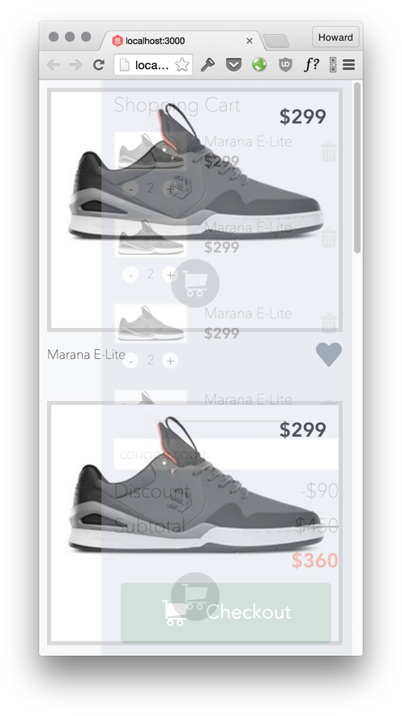

### Exercise: Add The Right Sidebar Hide/Show Toggle

We want to be able to hide & show the checkout sidebar when using mobile layout. Add a sidebar toggle button:

```html
<a class="site__right-sidebar-toggle">
  
</a>
```

We need to remember whether the checkout sidebar is shown in a global state. We could add a class to the body:

```js
var $toggle = document.querySelector(".site__right-sidebar-toggle");
$toggle.addEventListener("click",function() {
  document.body.classList.toggle("js-show-right-sidebar");
});
```

This way it's easy to adjusts the style of the page's components depending on this global state:

```css
.site__right-sidebar-toggle {
  /* styles for when the sidebar is hidden */
}

body.js-show-right-sidebar .site__right-sidebar-toggle {
  /* styles for when the sidebar is shown */
}
```

A few other requirements:

+ The sidebar should always show for non-mobile layouts.
+ The toggle button should be hiddne for non-mobile layouts.

Your result:

<video src="sidebar-toggle.mp4" controls></video>

# Design Details

Functionality-wise we are done. We'll add a few transparent overlays to create some fading effects.

There are two base colors:

+ Checkout sidebar background - `#C4CCDA == rgba(192,207,221,1)`
+ Main background - `#F7F8FA == rgba(247,248,250,1)`

You'll need to use linear gradients to adjust the alpha value (the transparency) of these two colors for different overlays.

### Exercise: Shopping Cart Gradient/Transparent Overlays

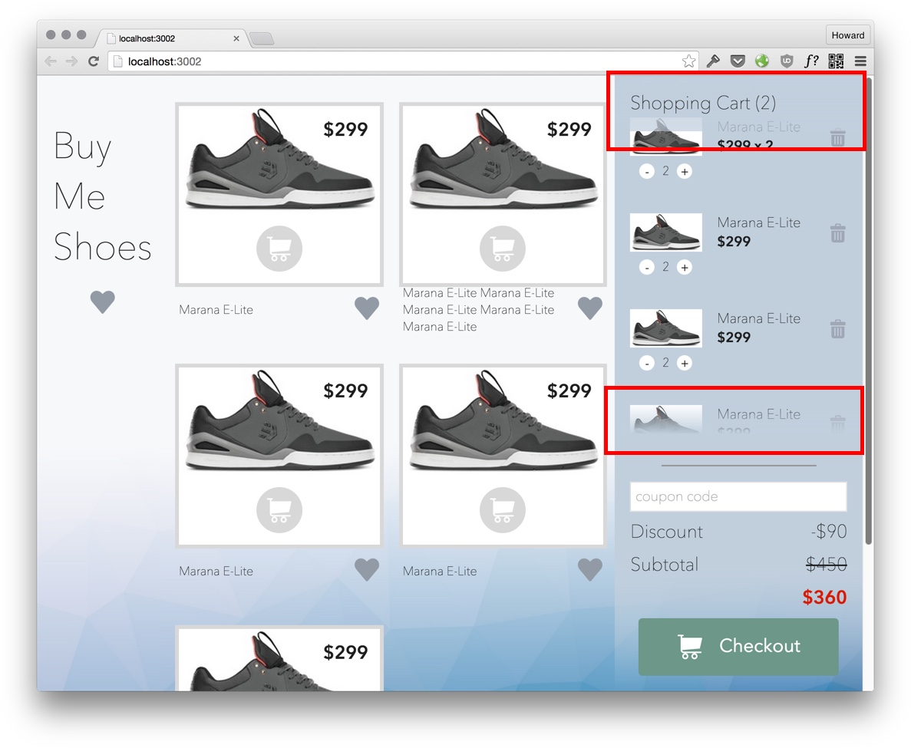

### Exercise: Background


### Exercise: Transparent Gradient For Right Sidebar

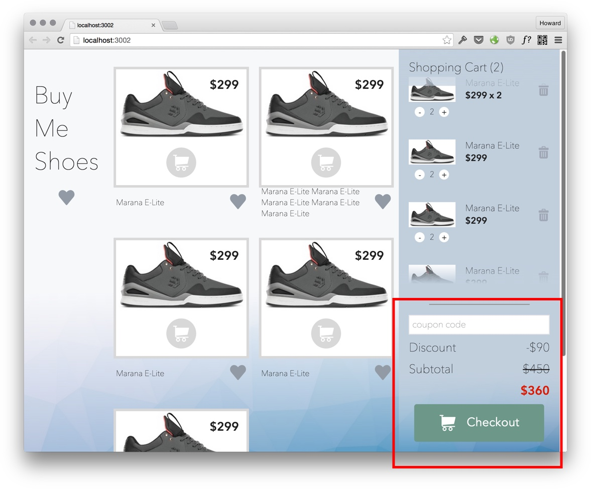

# Summary

+ Set image's width to 100% to fill the container, while preserving aspect ratio.
+ Use percentage to divide a container into parts.
+ Continuously decrease the size of the window to tweak responsive layout.