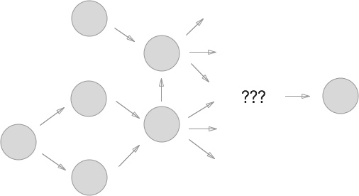
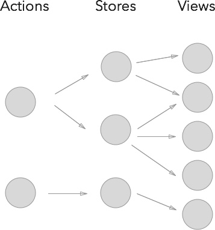
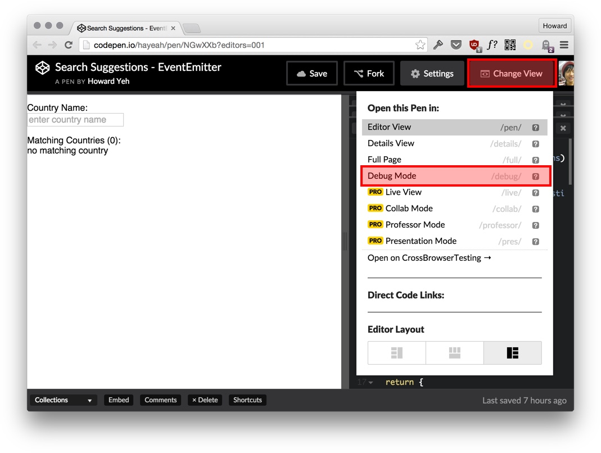
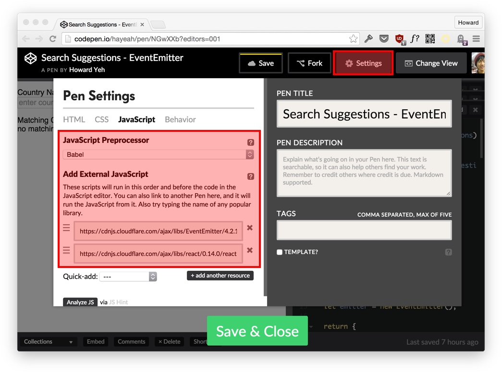

# Getting Started With Flux

Our shopping cart is just a static page. In this lesson, we'll use Flux to make it possible to add and remove shopping cart items.

If you are new to Flux, the best way to get started is to imitate the example apps Facebook provided:

+ [Todo Flux App](https://facebook.github.io/flux/docs/todo-list.html#content)
+ [Chat Flux App](https://github.com/facebook/flux/tree/master/examples/flux-chat/js)

Looking at these two apps, you might find Flux to be somewhat verbose and over-engineered. To better understand why Flux is designed that way, we will pretend that Flux doesn't exist and implement our own Flux framework from scratch.

At first, our code would follow a more conventional coding style, similar to MVC. As we implement our shopping cart application, though, we'll discover new needs. By refactoring our code to satisfy these needs, we would eveolve our app to be closer and closer to the real Flux.

The Flux architecture has four parts:


In this lesson we'll focus on Store->View. In other words, when we change the application data, the views should update.

# Lesson StarterKit

We have provided a reference implementation for the `buyshoes` page.

```
git clone https://github.com/hayeah/sikeio-buyshoes-startkit.git sikeio-buyshoes-react
cd sikeio-buyshoes-react
git checkout flux-start
```

You could use your own if you want.


# Flux Is Events Driven

The procedural programming model is what we are most used to. We tell the program to do one command after another:

```js
main() {
  doX()
  doY()
  doZ()
}
```

Another way to structure a program is with the event-driven architecture. The computer waits for something to happen, then it responds to the event. Suppose we are building a home automation system:

+ When X happens, do Y.
+ When the windows open, turn off the air conditioner.
+ When "howard" wakes up, make coffee.
+ When "howard" start working, turn off music.

This is called [inversion of control](https://en.wikipedia.org/wiki/Inversion_of_control), because you no longer tell the program when to do something. All that the program does is responding to what happens in the world.

User interface is another good fit for event-driven architecture, since all it does is responding to user interactions:

+ When user does X, application should do Y.
+ When user clicks "add to cart" button, add product to the shopping cart.
+ When user clicks on "trash can" button, remove product from the shopping cart.

MVC is procedural. The controller is the brain, telling different parts of the system to do as it commands.

Flux is an events-driven publish/subscribe system (pubsub). When a user interacts with the application, a message is broadcasted throughout the entire system. Any component of the system can decide whether it should respond or ignore an event. There is no centralized control.

The key advantage of publish/subscribe is that it's super extensible. Because the system is decentralized, you can easily add new features without modifying any existing code.

# Keeping PubSub Simple With Flux

But because there's no clear logical flow, a pubsub system can be horribly confusing. In a complicated pubsub system, an event could trigger more events, like spreading a gossip (or contagious disease):



It can be extremely difficult to trace the chain of events back to the original source. Unless we impose discipline in how we structure a pubsub system, it could easily become an impossible to understand mess.

Flux restricts its pubsub system by enforcing the four-steps "unidirectional flow" convention:


+ The only way to initiate an update cycle is by creating an action.
+ Stores can ONLY receive events from the dispatcher.
+ Views can ONLY receive events from stores.

With these restrictions in place, the Flux pub/sub system looks like:



### No Cascading Allowed

A store should never never NEVER cause other stores to update ("no cascading"). Let's see an example of how cascading might be useful, so we can appreciate what exactly it is we need to avoid.

Suppose I want to `like` a product, the MVC code might look like:

```js
let likedProducts = {
  products: [],

  addProduct(product) {
    this.products.push(product);

    // Update the associated view
    updateLikedProductsView();
  }
}

let product = {
  setLiked() {
    this.liked = true;
    likedProducts.addProduct(this);

    // Update the associated view
    updateProductView();
  }
}

product.setLiked();
```

1. Call `product.setLiked()`
2. `product` updates its associated view.
3. `product` adds itself to `likedProducts`.
4. `likedProducts` updates its associated view.

This seems like perfectly reasonable code, but you are not allowed to do this with Flux. When we build our shopping cart, please remember the following 3 important rules:

1. Store should never update other stores.
2. Store should never update other stores.
3. Store should never update other stores.

# The Store Pattern

A store is simply a set of functions to read and write data in the module. It's like a mini database.

Facebook's original Flux is more a pattern than a framework.  Rather than creating the `Store` class, we'll use plain JavaScript:

```js
// From NodeJS standard library
const EventEmitter = require("events");
function emitChange() {
  emitter.emit("change");
}

// The store's private data. Only accessible inside the module.
let _data = [];
// There can be other pieces of data you want the store to control.
let _foo = new Foo();

let _bar = new Bar();

let emitter = new EventEmitter();

module.exports = {
  // Reader API
  getData() {
    return _data;
  },

  // Writer API
  modifyData(data) {
    _data = data;

    // Every writer method should emit the "change" event.
    emitChange();
  },

  // Views can subscribe to "change" events.
  addChangeListener(callback) {
    emitter.addListener("change",callback);
  },

  removeChangeListener(callback) {
    emitter.removeListener("change",callback);
  },
}
```

+ There can be many reader methods.
+ There can be many writer methods.
+ All store should have the `addChangeListener` and `removeChangeListener` methods.
+ Never allow the outside world to modify the store's internal data directly.
+ The views would get data from a store by calling its reader methods.


Rather than having one store for the whole app, you usually create many stores to serve different needs.

This is the first version of the pattern, which we will refactor as we make progress.

### The NodeJS "events" Module

[EventEmitter](https://nodejs.org/api/events.html) is from NodeJS' standard library. Webpack would automatically find the `events` module from NodeJS, so you don't need to install the "events" package with npm.

The EventEmitter API is similar to how you might respond to a click event:

```js
function handleClick(event) {
  console.log("target",event.target);
  console.log("type",event.type);
}
button.addEventListener("click",handleClick);
```

We can use EventEmitter to create a fake button:

```js
const EventEmitter = require("events");

let fakeButton = new EventEmitter()

function handleClick(event) {
  console.log("target",event.target);
  console.log("type",event.type);
}

fakeButton.addListener("click",handleClick);

// Fake a click event
let event = {target: fakeButton, type: "click"};
fakeButton.emit("click");
```

# Implement Search Suggestions

Now let's see how Flux works in practice. We'll build a search input box with auto suggestions:

<video src="search-suggestions.mp4" controls></video>

We'll build this feature twice.

1. First time, using a centralized controller (MVC).
2. Second time, using EventEmitter (Flux).

The actual functionality is the same. These two examples only differ by how the pieces of code are glued together.

# Search Suggestions With Controller

[Search Suggestions MVC - Codepen Demo](http://codepen.io/hayeah/pen/pjdpPP?editors=001)

The MVC version of the "search suggestions" uses a centralized controller to glue the parts together:


First, `SearchInputView` calls `updateSearchInput` whenever its input changes:

```js
class SearchInputView extends React.Component {
  onChange(e) {
    let value = e.target.value;
    suggestionController.updateSearchInput(value);
  }

  render() {
    return <input onChange={this.onChange.bind(this)} placeholder="enter country name"/>;
  }
};
```

The controller uses the RemoteAPI to get the matching suggestions:

```js
let suggestionController = {
  updateSearchInput(queryString) {
    RemoteAPI.fetchSuggestions(queryString,(suggestions) => {
      this.receivedSuggestions(suggestions);
    });
  },
}
```

When the RemoteAPI returns with the result, the controller updates the store and the view:

```js
let suggestionController = {
  updateSuggestionsDisplayView() {
    // Forces the React component to re-render.
    this.suggestionsDisplayView.forceUpdate();
  },

  receivedSuggestions(suggestions) {
    suggestionsStore.setSuggestions(suggestions);
    this.updateSuggestionsDisplayView();
  },
}
```

The `suggestionStore` is just a getter/setter API for an array of strings:

```js
// Normally the store is in a module. Here we use closure.
let suggestionsStore = (() => {

  let _suggestions = [];

  // We could replace `return` with module
  // module.exports = { ... }

  return {
    // Reader API
    getSuggestions() {
      return _suggestions;
    },

    // Writer API
    setSuggestions(suggestions) {
      _suggestions = suggestions;
    }
  };
})();
```

The `SuggestionsDisplayView` registers itself with the controller when it's mounted:

```js
class SuggestionsDisplayView extends React.Component {
  componentDidMount() {
    suggestionController.setSuggestionsDisplayView(this);
  }
};
```

When the controller tells the `SuggestionsDisplayView` to update, it reads the latest data from `suggestionsStore`:

```js
class SuggestionsDisplayView extends React.Component {
  render() {
    let suggestions = suggestionsStore.getSuggestions();
    ...
  }
};
```

# Search Suggestions With EventEmitter

[Search Suggestions - EventEmitter Codepen Demo](http://codepen.io/hayeah/pen/NGwXXb?editors=001)

Now we remove the controller, and glue code together with pubsub instead:


Note: In "real" Flux, actions would use pubsub to cause stores to update. For now we'll keep it simple by allowing actions to call stores directly.

First the input box triggers the action `updateSearchQuery`:

```js
class SearchInputView extends React.Component {
  onChange(e) {
    let value = e.target.value;
    updateSearchQuery(value);
  }

  render() {
    return (
      <p>
        Country Name: <br/>
        <input onChange={this.onChange.bind(this)} placeholder="enter country name"/>
      </p>
    );
  }
};
```

The action `updateSearchQuery` fetches the data from server:

```js
// Action
function updateSearchQuery(query) {
  RemoteAPI.fetchSuggestions(query,(suggestions) => {
    receiveSuggestions(suggestions);
  });
}
```

When the suggestions return from the server, the action `receiveSuggestions` is triggered. This action would cause the store to update:

```js
function receiveSuggestions(suggestions) {
  suggestionsStore.setSuggestions(suggestions);
}
```

The store is mostly the same as before. The only difference is that the setter method `setSuggestions` now emits the `change` event:

```js
let suggestionsStore = (() => {
  let _suggestions = [];

  let emitter = new EventEmitter();

  return {
    getSuggestions() {
      return _suggestions;
    },

    setSuggestions(suggestions) {
      _suggestions = suggestions;
      emitter.emit("change");
    },

    addChangeListener(callback) {
      emitter.addListener("change",callback);
    },
  };
})();
```

Finally, the `SuggestionsDisplayView` listens to the `suggestionsStore`.

```js
class SuggestionsDisplayView extends React.Component {
  componentDidMount() {
    suggestionsStore.addChangeListener(this.forceUpdate.bind(this));
  }
};
```

The `SuggestionsDisplayView` reads the latest data from the `suggestionStore` whenever it has to renderer:

```js
class SuggestionsDisplayView extends React.Component {
  render() {
    let suggestions = suggestionsStore.getSuggestions();
    ...
  }
};
```

# Extending The Search Suggestions

Let's practice Flux by adding a few additional features. You can do these exercises directly in Codepen by forking the original code:


The codepen editor embeds the page in an iframe, so debugging is difficult. There's a debug mode that opens your code in a new window without the iframe:



You can also take a look at the JavaScript settings. The forked codepen project should inherit the same JavaScript settings:

+ Uses Babel.
+ Included React 0.14.
+ Included EventEmitter.



### Exercise: Show the length of the query string.

Fork the demo: [Search Suggestions - EventEmitter Codepen Demo](http://codepen.io/hayeah/pen/NGwXXb?editors=001)

Add a the `QueryLengthView` component to the length of the search string:

```js
class QueryLengthView extends React.Component {
  componentDidMount() {
    queryStore.addChangeListener(this.forceUpdate.bind(this));
  }

  render() {
    let query = queryStore.getQuery();

    return (
      <div>Query length: {query.length}</div>
    );
  }
}

let App = () => {
  return (
    <div>
      <SearchInputView/>
      <QueryLengthView/>
      <SuggestionsDisplayView/>
    </div>
  )
}
```

You'll need to:

+ Create the `queryStore`.
+ Modify `updateSearchQuery` so it causes `queryStore` to update.

Your result:

<video src="search-query-length-display.mp4" controls></video>

### Exercise: Sum population and area of matching countries

The countries data has the population and area of each country:

```js
 window.countriesData = [
  {
    "countryCode": "AD",
    "countryName": "Andorra",
    "population": "84000",
    "areaInSqKm": "468.0"
  },
  {
    "countryCode": "AE",
    "countryName": "United Arab Emirates",
    "population": "4975593",
    "areaInSqKm": "82880.0"
  },
  ...
]
```

Create a component to display the sums of all the countries that match the query string.

```js
class MatchingCountriesSummaryView extends React.Component {
  componentDidMount() {
    ...
  }

  render() {
    ...

    return (
      <div>
        <h3>Matching countries ({countries.length})</h3>
        <p>total area: {areaSum} </p>
        <p>total population: {populationSum} </p>
      </div>
    );
  }
}
```

Your result:

<video src="search-query-sum-area-population.mp4" controls></video>

Question: Which of a,e,i,o,u has the greatest population sum?

### Exercise: Be able to select a suggestion

When you click on a suggestion, the input box's value should be replaced. We want `SearchInputView` update whenever the `queryStore` changes.

There are now two separate paths that `SearchInputView` could be updated:

1. SearchInputView could modify itself by triggering `updateSearchQuery`.
2. SuggestionDisplayView triggering `updateSearchQuery`.


The first case where SearchInputView could trigger its own update makes it a [controlled component](https://facebook.github.io/react/docs/forms.html#controlled-components). It looks like:

```js
class SearchInputView extends React.Component {

  // ...

  onChange(e) {
    let value = e.target.value;
    updateSearchQuery(value);
  }

  render() {
    let query = queryStore.getQuery();

    return (
      <p>
        Country Name: <br/>
        <input value={query} onChange={this.onChange.bind(this)} placeholder="enter country name"/>
      </p>
    );
  }
};
```

The circular update of the controlled component is a little strange. It goes like this:

1. The input element updates the store (or `this.state`) with a new value.
2. The store notifies the input component that it changed.
3. The new value of the store (or `this.state`) is now circled back to the input component, and sets the value.

This maintains the unidirectional flow.

Your result:

<video src="search-suggestion-select.mp4" controls></video>

Question: How can you limit the user's query input to a maximum length of 10 characters? Can you add a single line in `SearchInputView` to impose this limit?

# Implement Shopping Cart With Flux

We'll start using Flux to implement the shopping cart functionality.

For now, to keep it simple, we'll allow views to call the store's writer methods directly. In other words, the "actions" are the same as the store's writer methods.

In the future we'll refactor the app so actions and stores are glued together with pub/sub instead of direct function calls.


### Exercise: Be able to add products to shopping cart

We'll put all the stores the `js/stores` directory. Create the file `js/stores/CartStore.js`:

```js
const EventEmitter = require("events");

let emitter = new EventEmitter();

function emitChange() {
  emitter.emit("change");
}

let _cartItems = {
  // "jameson-vulc": {
  //   id: "jameson-vulc",
  //   quantity: 1,
  // },
};

module.exports = {
  // Reader methods
  ...

  // Writer methods. These are the "actions".
  ...

  addChangeListener(callback) {
    emitter.addListener("change",callback)
  },

  removeChangeListener(callback) {
    emitter.removeListener("change",callback)
  },
}
```

All the stores you create would look similar to the above.


The Flux components are:

+ Action: `addCartItem(productId)`.
+ Store: `CartStore`.
+ Views: `Products` and `Cart`.

They should be glued together like this:

+ Clicking the "add to cart" button should trigger the `addCartItem` action.
+ `addCartItem` should cause the `CartStore` to update.
+ The `CartStore` should notify `Products` and `Cart` of changes by calling `emitChange`.
+ The `Products` and `Cart` components should read cart items from `CartStore`.

Instead of calling `CartStore.addCartItem`, we should call an action by its name:

```js
const CartStore = require("./CartStore");
const {addCartItem} = CartStore;

addCartItem(productId);
```

When we refactor the actions to an independent module, we could change the require, and keep everything else the same:

```js
const CartStore = require("./CartStore");
const {addCartItem} = require("./actions");

addCartItem(productId);

```

Your result:

<video src="addCartItem.mp4" controls></video>

### Exercise: Be able to remove products to shopping cart

Add the `removeCartItem(productId)` action.

Use the delete operator to remove a key from object.

```js
delete object[key]
```

Your result:

<video src="removeCartItem.mp4" controls></video>

### Exercise: Be able to adjust quantities

Add the `updateCartItemQuantity(productId,quantity)` action. It works like this:

```js
// increase by 1
updateCartItemQuantity(productId,quantity+1);

// decrease by 1
updateCartItemQuantity(productId,quantity-1);
```

+ In the `CartStore` make sure that quantity can never be less than 1.
+ `QuantityControl` does not need to listen to the store, since its parent is already listening.

Your result:

<video src="updateCartItemQuantity.mp4" controls></video>

### Exercise: Update Checkout's subtotal calculation

Finally, Checkout component's subtotal should also update.

You should ensure that only 2 decimal digits are displayed (rather than something liek 59.999967):

```js
subtotal.toFixed(2);
```

Your result:

<video src="update-checkout-subtotal.mp4" controls></video>

# Summary

We've used Flux to connect the views with changing data. It's worth mentioning again that the views are exactly the same as before, yet they can automatically update the UI with the latest data.

Isn't it great that we didn't have to add any code to update the DOM manually?

+ Flux is events-driven. It removes the centralized controller.
+ We've used EventEmitter to glue together stores and views.
+ The unidirectional flow from actions to stores to views.
+ A store should never update other stores.

Our Flux code is very simple, making it easy to see what exactly is going on. We'll make it a bit more elegant in the next lesson.

