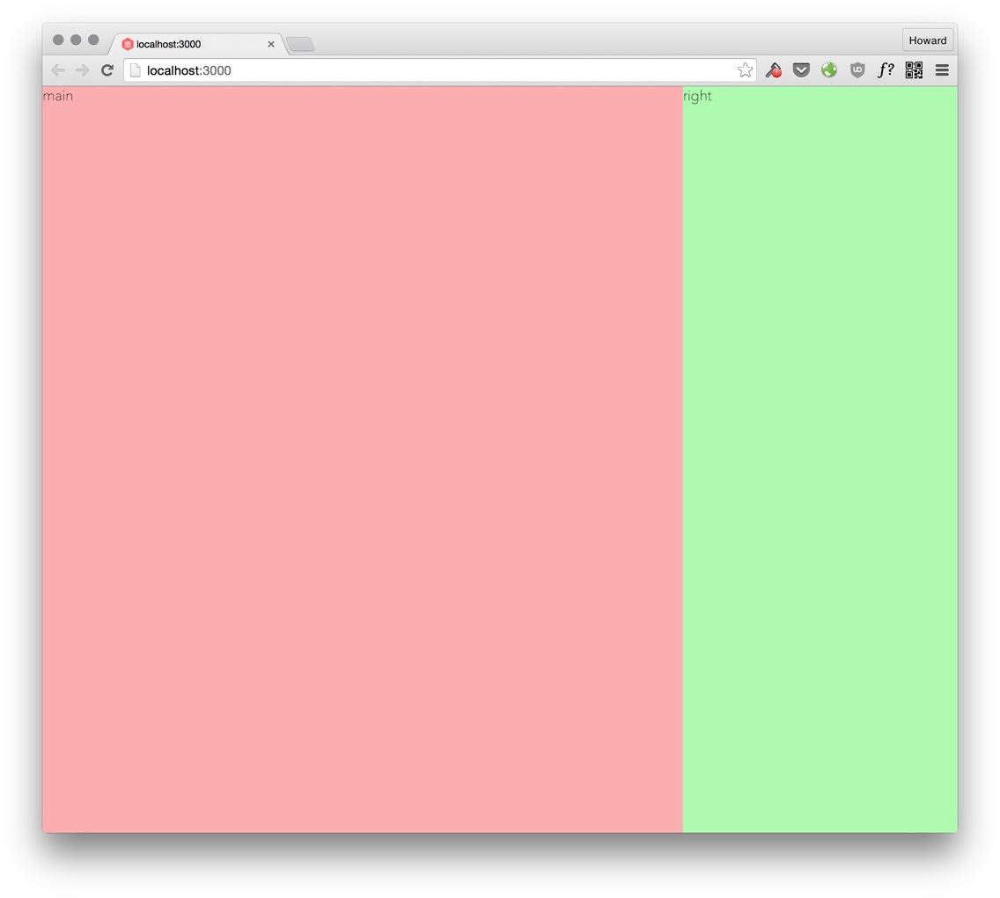
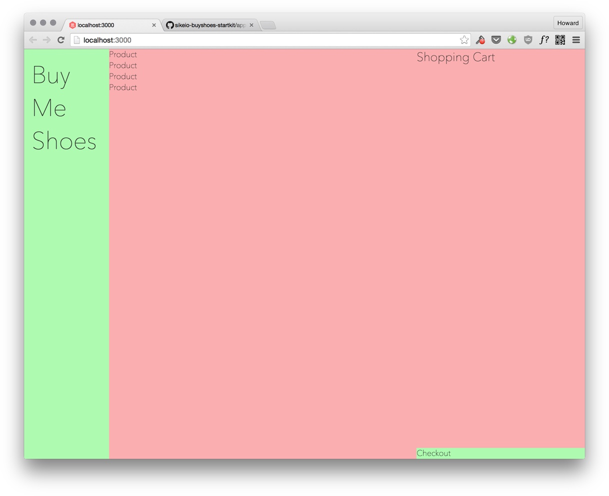
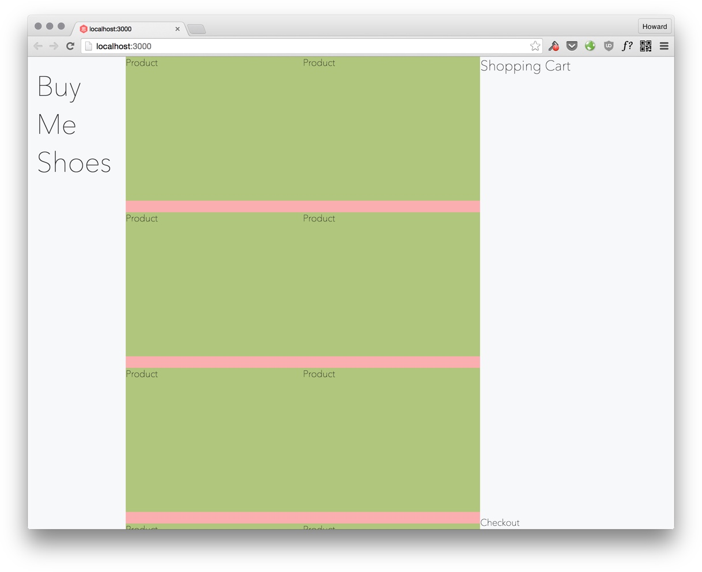

# Buy Shoes Site Layout


In the first week we learned to use flexbox to build a simple webpage. This week, we are going to build a more complex page with flexbox, a percentage-based responsive shopping cart.


# Starter Kit


To help you get started faster, download the starter kit for the `buyshoes` project:

```
git clone https://github.com/hayeah/sikeio-buyshoes-startkit.git buyshoes
```


After you've cloned the project, run `npm install` to install the project dependencies declared in `package.json`:

```
npm install
```


It's basically the same setup as the previous project. It has the same flexbox settings:

```css
/* Add more for your favourite HTML5 tags if you'd like */
body, div, span, a, img, h1, h2, h3, h4, h5 {
  box-sizing: border-box;
  position: relative;

  display: flex;
  flex-direction: column;
  align-items: stretch;
  flex-shrink: 0;
  align-content: flex-start;

  border: 0 solid black;
  margin: 0;
  padding: 0;
}

* {
  position: relative;
}
```


The `Makefile` is has the same tasks. To start development, open two separate terminals:

```
# terminal 1 - run browser-sync
make server

# terminal 2 - run the css compiler
make css
```


# BEM CSS Naming Convention


For this project, we will use the awkward "BEM" naming convention. It seems ugly, but in reality it works great! Let's first see a problem that a more traditional CSS naming convention might have.


Suppose you have a company component:

```html
<div class="company">
  <div class="name">Google</div>
</div>
```


The css for the company component looks like:

```css
.company {
  border: 1px solid blue;
}

.company .name {
  color: blue;
}
```


And you have a person component:


```html
<div class="person">
  <div class="name">Larry Page</div>
</div>
```


The CSS for the person component:

```css
.person {
  border: 1px solid red;
}

.person .name {
  color: red;
}
```


The goal of componentizing html fragments is that you can embed a component anywhere. What if you embed the `person` component inside `company`:


```html
<div class="company">
  <div class="name">Google</div>

  <div class="about">
    <div class="person">

      <!-- Is Larry Page red or blue? -->
      <div class="name">Larry Page</div>

    </div>
  </div>
</div>
```


It's not clear whether the color of "Larry Page" is red or blue. Although `.person .name` sets the color to red, the color could also be set by `.company .name`. BEM solves this problem with a brute force approach.


Since `name` is ambiguous, BEM prefixes all the elements that belong to a component with the component's name:

+ `.company .name` becomes `.company__name`
+ `.person .name` becomes `.person__name`

```html
<div class="company">
  <div class="company__name">Google</div>

  <div class="about">
    <div class="person">

      <div class="person__name">Larry Page</div>

    </div>
  </div>
</div>
```


Now it's clear what color "Larry Page" is.

With BEM, you never have to worry that embedding a component inside a container might inadvertently inherit styles from the parent container.


If you need different styles for different types of person, you create a modifier. For example:

+ `person--employee`
+ `person--founder`
+ `person--investor`

Using a modifier looks like:

```html
<div class="person person--founder">
  <div class="person__name">Larry Page</div>
</div>
```


In summary BEM means:

+ Block - A component.
+ Element - An element in a component.
+ Modifier - Extra styles to create a variant of a component.

Read more about BEM: [BEM 101](https://css-tricks.com/bem-101/)


# Site Layout


We'll start building the frame of the shoes store.


## Exercise: 2 Columns


Divide the page into two containers:


For responsive design on different screen sizes, we could adjust the 2 columns to be have different shares:

+ 60/40 (to make the sidebar bigger for narrow screens).
+ 70/30.
+ 80/20 (to make the sidebar smaller for wider screens).


Use this html:

```html
<div class="site">
  <!-- 70% main area -->
  <div class="site__main">
    main
  </div>

  <!-- 30% sidebar -->
  <div class="site__right-sidebar">
    right
  </div> <!-- site__right-sidebar -->
</div> <!-- site -->
```


Your result:




## Exercise: Subdivision


Quite often you'd want to divide a container left/right or top/down. Here we need to do both.

+ Divide `site__main` to left and right parts.
+ Divide `site__right-sidebar` to top and bottom parts.


The html:

```html
<div class="site">
  <div class="site__main">
    <div class="site__left-sidebar">
      <h2>Buy Some Shoes</h2>
    </div>

    <div class="site__content">
      <div class="products">
        <div class="product">Product</div>
        <div class="product">Product</div>
        <div class="product">Product</div>
        <div class="product">Product</div>
      </div> <!-- products -->
    </div> <!-- site__content -->
  </div>

  <div class="site__right-sidebar">
    <div class="cart">Shopping Cart</div>
    <div class="checkout">Checkout</div>
  </div> <!-- site__right-sidebar -->
</div> <!-- site -->
```


Question: What's the difference between `flex-basis: 0`  and `flex-basis: auto`? If you used `flex-basis: auto`, what problem would you run into if there is a lot of content in `site__content` or `cart`?


Your result:




# Products Layout


Next, we want to fill `site__content` with products. Just make each `product` container 50%, so two of these would fill their parent container:


+ `flex-wrap: wrap` tells the container to break into multiple lines if the content is too long.


### Exercise: Products Layout


We'll fill in the product content (image, title, price) later. For now, let's use explicit width and height to create the product placeholders:

```css
.product {
  width: 50%;
  height: 250px;
}
```


When we add content to the `product` containers we'll remove the `height` property, so that their heights would fit the content.


Your result:




# Fixed Sidebars


We don't want the sidebars to move when we scroll the page.


### Exercise: Make Sidebars Fixed


Set sidebars to `position: fixed`. When an element is `fixed` or `absolute`, it is "taken out of the layout", as though it doesn't exist. This is why `site__content` expands into the space that was occupied by the left sidebar:


There are two ways to fix that. You could:

1. Reserve the sidebar space by adding padding to the container.
2. Reserve the sidebar space by adding margin to the content.

Choose whichever that's more convenient. In this case it doesn't matter.


Your result:

<video src="fixed-sidebars.mp4" controls autoplay loop></video>


# Scrollable Shopping Cart


If there many items in the cart, we want to be able to scroll through them. For now, we'll specify an explicit height for the cart items, so we can work on the layout before working on the details.


### Exercise: Make Shopping Cart Scrollable


Add the following HTML:

```html
<div class="cart">
  <h3 class="cart__title">Shopping Cart</h3>
  <div class="cart__content">
    <div class="cart-item">cart item</div>
    <div class="cart-item">cart item</div>
    <div class="cart-item">cart item</div>
    <div class="cart-item">cart item</div>
    <div class="cart-item">cart item</div>
    <div class="cart-item">cart item</div>
    <div class="cart-item">cart item</div>
  </div>
</div>

<div class="checkout">
</div> <!-- checkout -->
```


There isn't anything in cart-item or checkout yet. We'll temporarily give them a height:

```css
.cart-item {
  height: 150px;
  margin-bottom: 20px;
  background: rgba(0,255,0,0.3);
}

.checkout {
  height: 300px;
  background: rgba(0,0,255,0.3);
}
```


The CSS property you need is [overflow](https://developer.mozilla.org/en-US/docs/Web/CSS/overflow). It controls what happens when there's too much content to fit inside a container.


Your result:

<video src="scrollable-cart.mp4" controls loop autoplay></video>


# Better Shopping Cart Scrolling


There are two problems with the shopping cart scrolling:

+ There are two scrollbars. One for the window, and one for the shopping cart. Very ugly.
+ When you scroll to the end of the shopping cart, the window scrolls.


Let's replace the default scrollbar with the JavaScript plugin [perfect-scrollbar](http://noraesae.github.io/perfect-scrollbar/). It looks like:

<video src="perfect-scroll-demo.mp4" controls loop autoplay></video>


Install it:

```
npm install perfect-scrollbar@0.6.4 --save
```


### Exercise: Use Perfect Scrolling


Use a `<script>` tag to load perfect-scroll. Then in `app.js`:

```js
function makeCartScrollNicely() {
  var cart = document.querySelector(...);
  Ps.initialize(cart);
}
```


Your result:

<video src="scrollable-cart-perfect.mp4" controls loop autoplay></video>


### Exercise: Don't Scroll The "Shopping Cart" Title


Finally, we don't want the title to move when we scroll the cart's content. You need to:

1. Keep the title in the same place.
2. Reserve space at the the top of the scrollable content, so the title doesn't cover the first item.


Your result:

<video src="cart-scroll-fixed-title.mp4" controls></video>


# Summary


+ `flex-grow: 1; flex-basis: 0` is a useful pattern to create a container that grows to fill its parent, but does not grow bigger than its parent even if there is a lot of content.
+ Use `perfect-scrollbar` is a good replacement for the browser built-in scrollbar.


