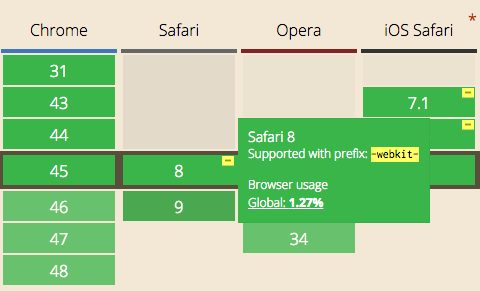
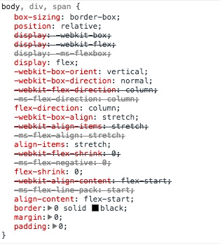

# CSS Base

Before we start working on the project, we should add some CSS to solve common cross-browser problems.

Furthermore, to make CSS layout easier, we'll adopt the ReactNative's flexbox settings.


# PostCSS

For this project, we just want two additional CSS features:

1. `@import` to create a bundle from many CSS files.
2. Use `autoprefix` to generate browser specific CSS property names for "experimental" features.


[Sass](http://sass-lang.com/) and [Less](http://lesscss.org/) are the two most popular CSS preprocessors. They are complete languages with lots of features (variables, loops, conditionals, functions) to generate complex CSS stylesheets. We won't be needing any of that.


An alternative to Less/Sass is [PostCSS](https://github.com/postcss/postcss). PostCSS is not a language. It is a parser that parses the standard CSS syntax, and allows you to install JavaScript plugins to transform the CSS in different ways. With PostCSS, you can add only the features you need.


We'll install the [PostCSS command line tool](https://github.com/code42day/postcss-cli):


```
npm install postcss-cli@2.1.0 --save-dev
```


See help:


```
$ postcss -h
Usage: node_modules/.bin/postcss -use plugin [--config|-c config.json] [--output
|-o output.css] [input.css]

Options:
  -c, --config       JSON file with plugin configuration
  -u, --use          postcss plugin name (can be used multiple times)
  -o, --output       Output file (stdout if not provided)
  -d, --dir          Output directory
  -s, --syntax       Custom syntax
  -p, --parser       Custom syntax parser
  -t, --stringifier  Custom syntax stringifier
  -w, --watch        auto-recompile when detecting source changes
  -v, --version      Show version number                               [boolean]
  -h, --help         Show help                                         [boolean]

Examples:
  postcss --use autoprefixer -c options.    Use autoprefixer as a postcss plugin
  json -o screen.css screen.css
  postcss --use autoprefixer --             Pass plugin parameters in plugin.
  autoprefixer.browsers "> 5%" -o screen.   option notation
  css screen.css
  postcss -u postcss-cachify -u             Use multiple plugins and multiple
  autoprefixer -d build *.css               input files
```


# Vendor Prefix

Take a look at the browser support chart for flexbox ([Can I Use: Flexbox](http://caniuse.com/#search=flex)):



You'd see that for Safari 8 there's the note:


```
Supported with prefix: -webkit
```


That's the [vendor prefix](https://developer.mozilla.org/en-US/docs/Glossary/Vendor_Prefix) for Safari 8. Instead of writing:


```css
.a-flexible-row {
  flex-direction: row;
}
```


You need to add the vendor prefix for every browser you support. The CSS rule might look like:


```css
.a-flexible-row {
  /* Browsers that supports flexbox without vendor prefix. */
  flex-direction: row;
  /* Safari 8, Android 4.3 or earlier, iOS Safari 7/8 */
  -webkit-flex-direction: row;
  /* IE 10 */
  -ms-flex-direction: row;
}
```


So you'll need to:

+ Know which features need vendor prefixes.
+ Remember to add these prefixes everywhere you use these features.
+ As a feature mature new browsers no longer requires the vendor prefix.
  + For example, Safari 9 and IE 11 don't need the vendor prefix for flexbox.
+ As the percetange of users that use older browser decrease, you might decide to drop vendor prefix support.
  + If you only build for mobile, you might not care for IE 10.


Getting all these right is obviously very complicated. The [autoprefixer](https://github.com/postcss/autoprefixer) tool automatically adds vendor-prefixes for you. Additionally, it uses a [database of browser marketshare](https://github.com/ai/browserslist) to decide whether a particular feature still needs vendor prefixing.

To install autoprefixer:


```
npm install autoprefixer@6.0.2 --save-dev
```


### Exercise: Use Flexbox Globally

Although ReactNative implements flexbox, it uses a different default flexbox settings than the browser. One big difference is that in ReactNative items are arranged from top-to-bottom by default, but in the browser the default is left-to-right.

It turns out that ReactNative's settings are nicer to work with, so let's make the browser behave the same way.

Add the [ReactNative flexbox settings](https://github.com/facebook/css-layout#default-values) to the file `css/app.css`:


```css
body, div, span {
  box-sizing: border-box;
  position: relative;

  display: flex;
  flex-direction: column;
  align-items: stretch;
  flex-shrink: 0;
  align-content: flex-start;

  border: 0 solid black;
  margin: 0;
  padding: 0;
}
```


Run this command to transform your css file:


```
mkdir -p bundle
postcss --use autoprefixer css/app.css --output bundle/app.css
```


You'd see in `bundle/app.css` the auto prefixed CSS properties:


```css
body, div, span {
  box-sizing: border-box;
  position: relative;

  display: -webkit-box;

  display: -webkit-flex;

  display: -ms-flexbox;

  display: flex;
  -webkit-box-orient: vertical;
  -webkit-box-direction: normal;
  -webkit-flex-direction: column;
      -ms-flex-direction: column;
          flex-direction: column;
  -webkit-box-align: stretch;
  -webkit-align-items: stretch;
      -ms-flex-align: stretch;
          align-items: stretch;
  -webkit-flex-shrink: 0;
      -ms-flex-negative: 0;
          flex-shrink: 0;
  -webkit-align-content: flex-start;
      -ms-flex-line-pack: start;
          align-content: flex-start;

  border: 0 solid black;
  margin: 0;
  padding: 0;
}
```


Link to `bundle/app.css` in the `head` element:


```html
<head>
  ...
  <link rel="stylesheet" type="text/css" href="/bundle/app.css">
  ...
</head>
```


In Chrome Inspector, you should see that `body` is now a flexbox:




Don't worry if you don't understand what these properties do. We'll learn about them soon!


# normalize.css

Browsers can behave subtly differently from each other. [normalize.css](https://github.com/necolas/normalize.css) makes browsers behave more alike. For example, did you know that in IE 8/9/10  `img` would have a border if it's inside an `a` element?

normalize.css includes the fix for that:


```css
/* https://github.com/necolas/normalize.css/blob/2bdda84272650aedfb45d8abe11a6d177933a803/normalize.css#L185-L187 */
img {
  border: 0;
}
```


It also define HTML5 elements:


```css
/* https://github.com/necolas/normalize.css/blob/2bdda84272650aedfb45d8abe11a6d177933a803/normalize.css#L33-L47 */
article,
aside,
details,
figcaption,
figure,
footer,
header,
hgroup,
main,
menu,
nav,
section,
summary {
  display: block;
}
```


Install it with npm:


```
npm install --save normalize.css@3.0.3
```


### Exercise: Include normalize.css

Instead of using another `link` element to, let's use the [postcss-import](https://github.com/postcss/postcss-import) plugin to import normalize.css.

Install `postcss-import`:


```
npm install --save-dev postcss-import@7.0.0
```


normalize.css is installed at `node_modules/normalize.css/normalize.css`. In `css/app.css` we can import normalize.css using relative path:


```
/* css/app.css */
@import "../node_modules/normalize.css/normalize.css";
```


Run this command to produce the bundled css:


```
postcss --use autoprefixer --use postcss-import css/app.css --output bundle/app.css
```


You should now see normalize.css in `bundle/app.css`.

Because normalize.css is installed in the `node_modules` directory, you can actually use the package name to import it:


```
@import "normalize.css";
```


> Note: PostCSS takes the output from one plugin and send it to the next plugin. The above command can be written as a unix command pipeline.


```
cat css/app.css | postcss --use autoprefixer | postcss --use postcss-import | cat > bundle/app.css
```


# Live-Edit

Change your Makefile to the following:


```
.PHONY: css
css:
  mkdir -p bundle
  postcss --watch --use autoprefixer --use postcss-import css/app.css --output bundle/app.css

.PHONY: server
server:
  browser-sync start --server --files='index.html,bundle/app.css'


.PHONY: clean
clean:
  rm -r bundle
```


We've made two changes:

1. Added `--watch` option to postcss, so it rebuilds `css/app.css` whenver you make changes.
2. Added `bundle/app.css` to `--files`, so BrowserSync reloads whenever we rebuild.

Try making the background red:


```html
body, html {
  width: 100%;
  height: 100%;
}

body {
  background-color: rgba(255,0,0,0.3);
}
```


