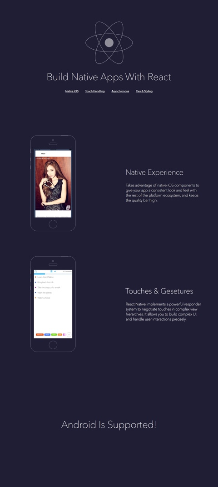
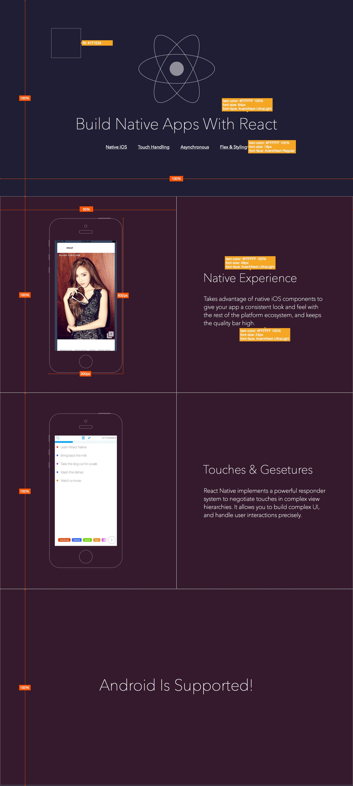
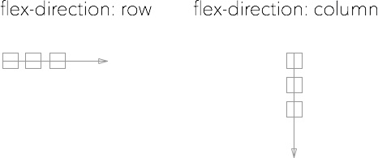
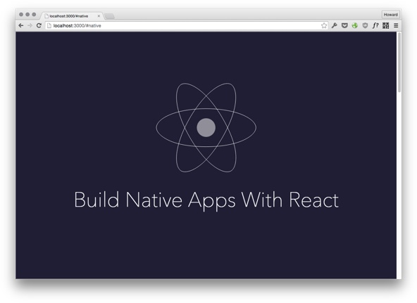
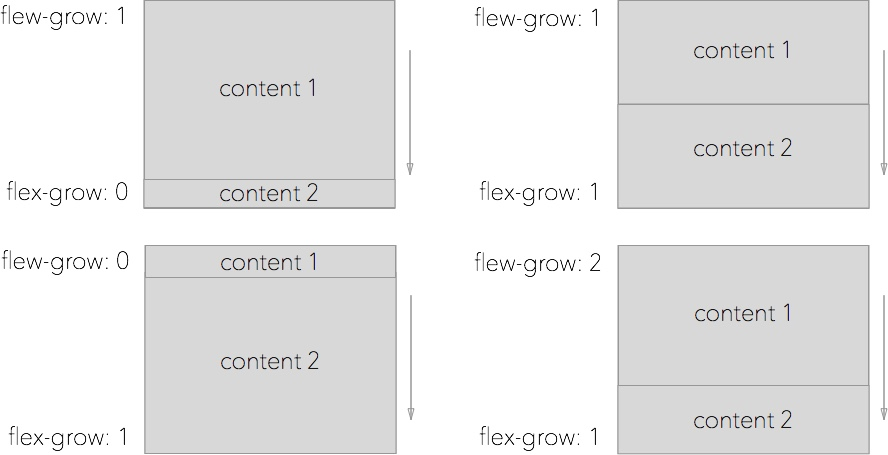
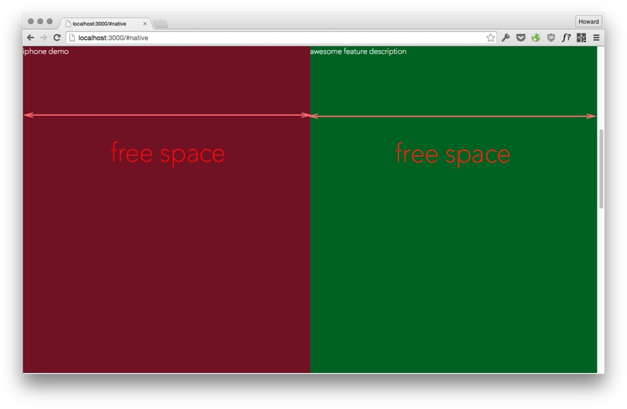
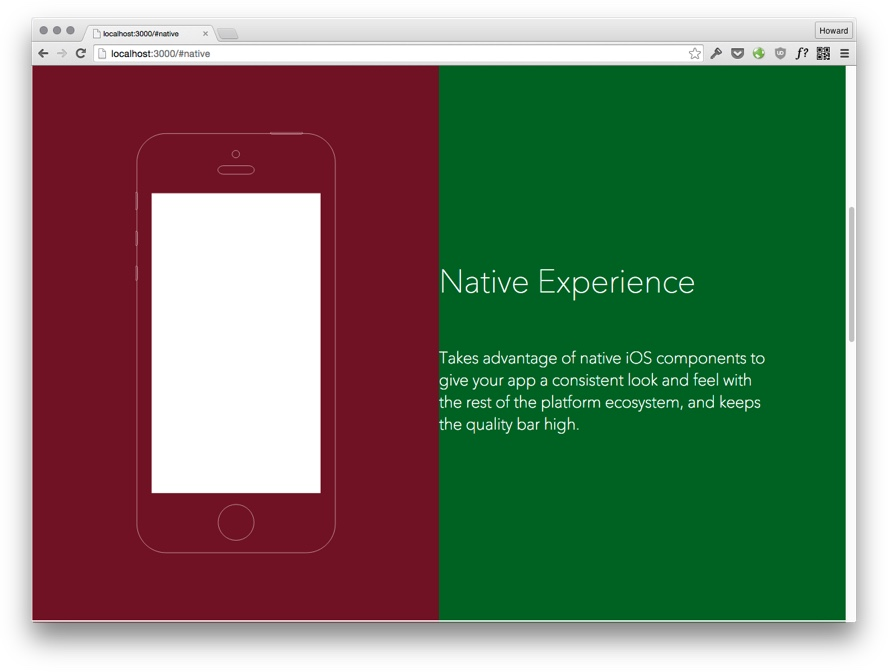
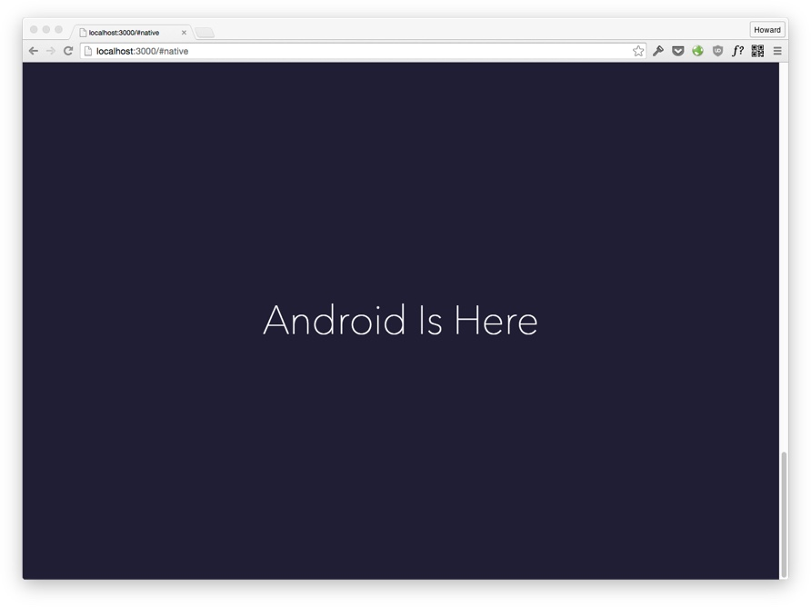

# Layout With Flexbox

The original CSS [visual rendering model](http://www.w3.org/TR/WD-CSS2/cover.html#toc) was drafted in 1998, at a time when most pages were documents, and making apps that runs in the browser was a radical idea. The web had evolved multiple times since then, yet we still use the same dated layout engine from 1998. CSS2 is proven technology, there is a huge body of community knowledge, but it's a huge pain.

For example, if you want to vertically center some content, there isn't one way to do it, but many different ways that only work in special circumstances:


To become a competent frontend developer, you have to learn all kinds of weird, ugly, unnatural tricks to handle different layout needs.

Flexbox, in contrast, was designed specifically for creating UI for the modern web. It is not simple, and just like any other complex layout engine, you'd sometime find it behaving in surprising ways. Almost always, though, there's a straightforward explanation why.

It does take practice to use flexbox well. But compared to traditional layout with CSS, flexbox is so much easier!


### Our Mission

In this lesson we'll use flexbox to implement the basic layout of our web page:




# Design Spec

If you have Sketch, you can download the original Sketch file:

[ilovereact-plain.sketch](ilovereact-plain.sketch)

If you don't have Sketch, you can download the annotated design:

[](annotated-layout.jpg)


# Download Design Assets

You can download all the design assets from the repo:

[hayeah/iLoveReact-assets](https://github.com/hayeah/iLoveReact-assets)

Add these images to the `img` directory in your project.


# Introduction To Flex

[A Complete Guide to Flexbox](https://css-tricks.com/snippets/css/a-guide-to-flexbox/) has a good summary of all the CSS properties related to flexbox. It's a bit too much information to get started with.

We'll start with just three properties: `flex-direction`, `align-items`, `justify-content`.


+ `flex-direction` - whether child items are arranged horizontally or vertically.

  

+ `align-items` and `justify-content` - controls how the children should be arranged in the parent container.

  


+ To center items both horizontally and vertically in a container:

  


The alignment properties `align-items` and `justify-content` are very easy to mix up.

+ `justify-content` - controls where the items should be on the arrow.
  + This is the "main-axis" of the flex container.
+ `align-items` - controls where the arrow should be in the container.
  + This is the "cross-axis" of the flex container.


So `align-items: center` could mean horizontal centering or vertical centering depending on what the flex-direction is. One trick to help us remember is by understanding the `align-self` property.

`align-self` can give a different `align-item` value to a particular item in a flex container.


```css
.container {
  flex-direction: row;
  align-items: center;
  justify-content: center;
}

.red {
  /* This is the only item that's `flex-start` */
  align-self: flex-start;
}
```


What should `align-self` do? `align-self` should not move the item along the flex-direction (the main-axis), otherwise the order of the `.red` element would change:


`align-self` should move the item cross-axially so the horizontal order of the row stays the same:


Following this reasoning, it's easy to remember which direction `align-self` is. And `align-items` must be in the same direction as `align-self`.


# Page Style

Let's first define the typography and background color of the page:


```css
body {
  background-color: #1F1E34;
  color: #FFF;
  font-family: "Avenir Next",
      "HelveticaNeue-Light", "Helvetica Neue Light", "Helvetica Neue", Helvetica,
      Arial, "Lucida Grande", sans-serif;
  font-weight: 100;
}

h1 {
  font-size: 64px;
  font-weight: 100;
}

h2 {
  font-size: 48px;
  font-weight: 100;
}

p {
  font-size: 24px;
}

a {
  font-weight: 400;
  color: #FFF;
}

a:hover {
  font-weight: 400;
  color: #DADADA;
  text-decoration: none;
}
```


# Page Layout

### Exercise: Full Page Sections

There are four sections in this web page. You should make each section as tall and as wide as the screen.

To make them easier to see, you could temporarily set their background to red:


```css
.section {
  background-color: rgba(255,0,0,0.3);
  border: 2px solid #FFF;
}
```


The sections should look like:

<video src="fullpage-sections.mp4" controls></video>


### Exercise: Title And Logo

Add the following to the first section:


```html

<h1>Build Native Apps With React</h1>
```


Your result:




### Exercise: Navigation Links

Since items in a single flex container can only flow in one direction, you need to nest flex containers if some items are vertically arranged, and some other items are horizontally arranged:


+ Add a horizontal flex container to hold the navigation links.
+ Add padding to space them apart.

Add these internal links:


```html
<a href="#native">
  Native iOS
</a>

<a href="#touch">
  Touch Handling
</a>

<a href="#async">
  Asynchronous
</a>

<a href="#flex">
  Flex &amp; Styling
</a>
```


Your result:


# Flex-Grow And Stretch

{ya fuck. flex-grow is unwieldly. it grows to unbounded length if there's too much text content. so stupid.}

Our next goal is to divide the page into two equal parts:


The obvious way to accomplish this is to set the width to 50%, and height to 100%. For this exercise, though, we are going to use flexbox. First, let's add the following html to the second section:


```html
<div class="iphone-demo">
  iphone demo
</div>

<div class="feature-description">
  awesome feature description
</div>
```

```css
.iphone-demo {
  background-color: rgba(255,0,0,0.3);
}

.feature-description {
  background-color: rgba(0,255,0,0.3);
}
```


Initially, these two containers are just big enough to contain their text content:


If you remove their content, they'd collapse to a 0x0 box (try it!).


There are two properties you can set to make a flexbox bigger than its content:

+ `align-self: stretch` - stretch the element along the cross-axis.
+ `flex-grow: 1` - stretch the element along the main-axis.


Like `align-items` and `justify-content`, their behaviour depends on the flex direction:


Why is `flex-grow` a number? If `flex-grow` is 0, that element doesn't grow. Otherwise, the number is the proportion an element should stretch to fill the available space.




As a concrete example, we can make the first container take up 1/3 of the space, and the second container take up 2/3 of the space:


```css
.iphone-demo {
  flex-grow: 1;
  background-color: rgba(255,0,0,0.3);
}

.feature-description {
  flex-grow: 2;
  background-color: rgba(0,255,0,0.3);
}
```


### Exercise: Left Right Layout

Use `flex-grow` and `align-self` to divide the second section in two.

You result:


Note: Make sure these containers are empty. If the amount of content in one container is more than the other, then one container would be bigger than the other.


We'll fix this problem in the next exercise.


# Flex Basis

The size of a flexbox is determined by two factors:

1. How much content there is in the flexbox.
2. How much free space there is in the parent container. If `flex-grow` is non-zero, grow to fill the space.

If a flexbox is allowed to grow, it would grow as much as possible to fit the content. Let's add more content to the right container:


```html
<div class="feature-description">
  <h2>Native Experience</h2>
  <p>
    Takes advantage of native iOS components to give your app a consistent look and feel with the rest of the platform ecosystem, and keeps the quality bar high.
  </p>
</div>
```


It expands to fit the content in one line, squeezing out the left container:

<video src="flex-basis-auto-greedy.mp4" controls loop></video>


The key to understand this behaviour is that the amount of "free space" is calculated after growing the containers to fit the content:


Then the free space is divided according to `flew-grow` factors. This explains why the containers are not the same width:


We can use the `flex-basis` property to override the size of a flexbox when calculating free space. If we set `flex-basis: 0` for both children, it is as though their widths are zero when their parent calculates the free space. The free space (the entire width of the parent) is then divided between the two children:




The `flex-basis` property is like the min-width of flexbox. It determines how much space the flexbox reserves for itself. The default `flex-basis: auto` means "reserve as much space as needed to fit the content". And `flex-basis: 50px` means reserve 50px, but grow if there's more free space.

Question: Setting `flex-basis: 50%` also makes the two containers equal. Why? How is it different from `flex-basis: 0`?


### Exercise: Adjust Flex-Basis

Add to section 2:

```html
<div class="iphone-demo">
  
</div>

<div class="feature-description">
  <h2>Native Experience</h2>
  <p>
    Takes advantage of native iOS components to give your app
    a consistent look and feel with the rest of the platform ecosystem,
    and keeps the quality bar high.
  </p>
</div>
```


Add to section 3:

```html
<div class="iphone-demo">
  
</div>

<div class="feature-description">
  <h2>Touches &amp; Gestures</h2>
  <p>
    React Native implements a powerful responder system to
    negotiate touches in complex view hierarchies. It allows you
    to build complex UI, and handle user interactions precisely.
  </p>
</div>
```

Your result:




# Android Is Coming

### Exercise: Add "Android Is Here"

In the last section, add:

```html
<h1>Android Is Here</h1>
```

Result:




# Flex: 1

In ReactNative you'd often seen the mysterious setting `flex: 1` to grow a flexbox. `flex` is a shorthand that sets `flex-grow`, `flex-shrink`, and `flex-basis` at the same time. The default is:

```css
flex: 0 1 auto;
/*
flex-grow: 0;
flex-shrink: 1;
flex-shrink: auto;
*/
```


And `flex: 1` means `flex: 1 1 auto`, or written in full:

```css
flex-grow: 1;
flex-shrink: 1;
flex-basis: auto;
```


# Summary

There are many properties and many possible settings. A good reference to refresh your memory:

+ [CSS Tricks - A Complete Guide to Flexbox](https://css-tricks.com/snippets/css/a-guide-to-flexbox/)

If you run into a strange layout problem, it's often quicker to read the spec to understand the exact behaviour:

+ [CSS Flexible Box Layout Module Level 1](http://www.w3.org/TR/css-flexbox-1)


Control which axis (horizontal or vertical) items are arranged:

+ `flex-direction: row`, `flex-direction: column`


Control where in the container items are (against one of the edges, or centered):

+ `align-items`, `align-self`, `justify-content`


Control how items grow or shrink：

+ `flex-grow`, `flex-basis`, `flex-shrink`, `align-self: stretch`


Shorthand:

+ `flex: 1` means `flex-grow: 1; flex-shrink: 1; flex-basis: auto;`


