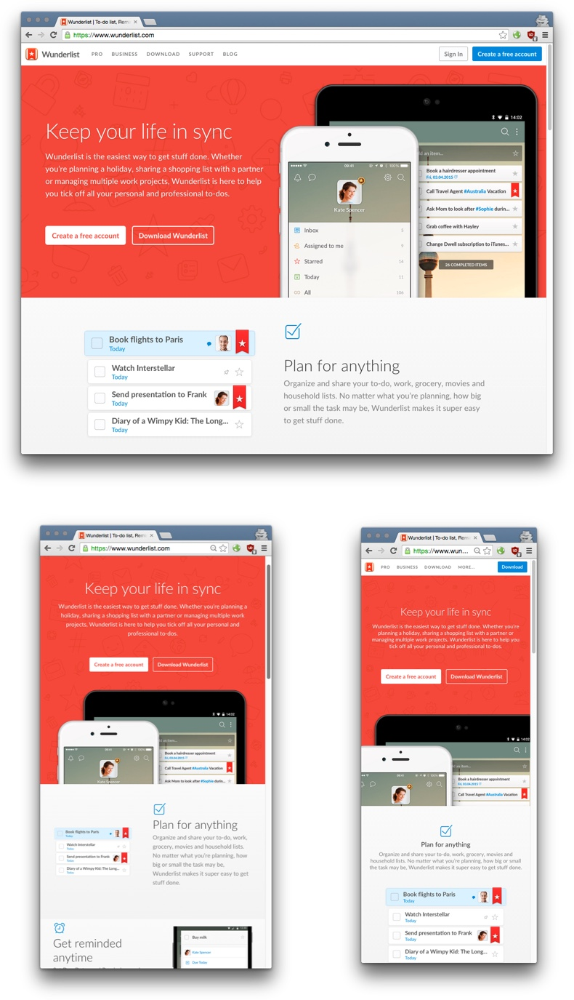
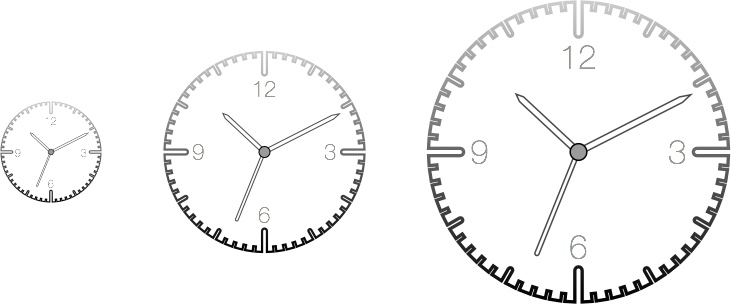
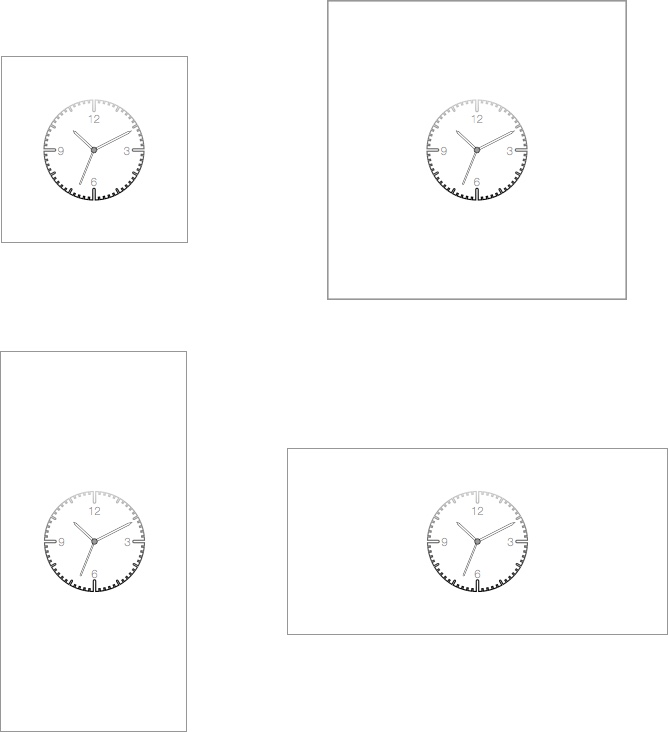
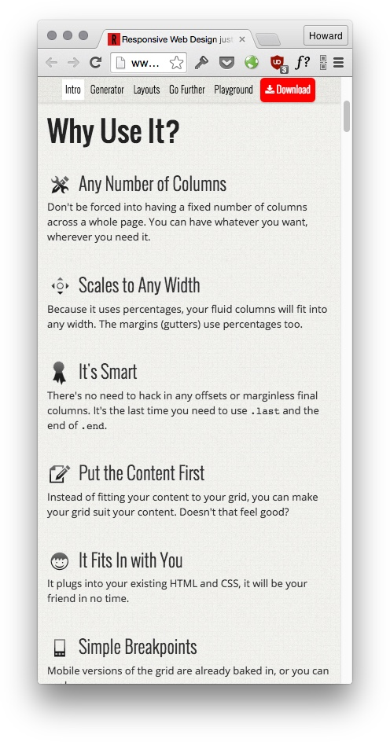
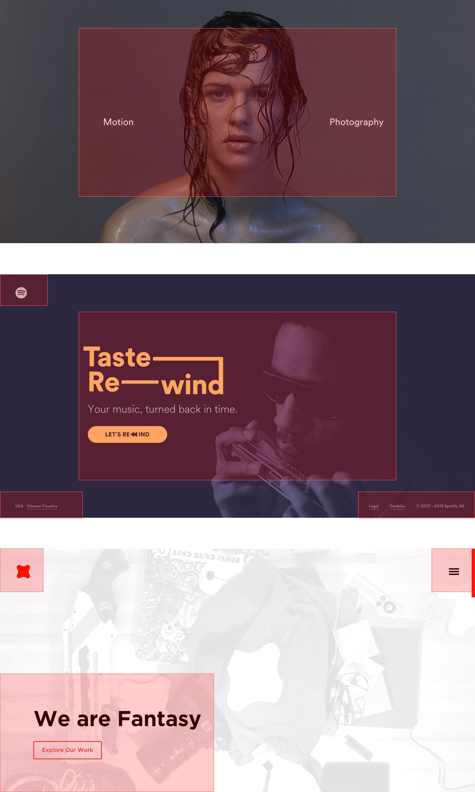
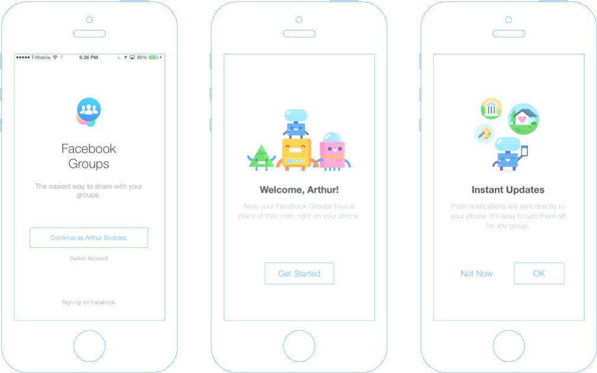

# What Is Responsive Design?

When you get a design from a designer to implement, it's usually fixed to a particular width. At best, the designer might provide you with several versions of the same design at different widths and heights:

(Design By [Wunderlist](https://www.wunderlist.com))

But the static design is never enough. You need to figure out what the design should look like for *every* possible widths and heights:

<video src="wunderlist-resize.mp4" controls></video>

That's why it's important for us to understand the ideas behind a responsive design, not just the implementation techniques.

Let's use a clock as an example. A clock is scalable. You can make it as big as you like, and it looks fine:

But responsive design isn't just about making the clock bigger or smaller as necessary. If the height and the width of the screen are not the same, the clock is skewed:

The simplest way to make this a responsive design is to put the clock right at the center for any width or height:

The key idea behind this responsive design strategy is "centering". It doesn't matter what the size of the clock is. There are, of course, many other responsive design strategies other than centering.

### The Responsive Elevator Metaphor

Responsive design is about arranging objects neatly given any amount of space. That's a pretty abstract idea, so we'll use a real world metaphor to illustrate it. Let's start with an empty elevator:

The first guy that comes in would stand right in the middle ("it's all mine!"):

Another guy comes in, they'd want to put as much distance as possible between each other ("stay away from me..."):

·

A women comes in, because the elevator is pretty small, she feels more comfortable standing in the corner. The guys, out of courtesy, move back to give her more space:

If the elevator magically becomes wider, she might decide to stand between the two guys, because there's now more space:

This is what responsive design is like. As the size of the screen (elevator) changes, the objects in it arrange themselves to "feel comfortable".

# Responsive Design Methods

There are 2 popular methods to create reponsive designs. One is to design with a grid system, and the other is full-page design.

## Responsive Grid

A responsive grid is easy to use. A popular frontend framework like Bootstrap would have a responsive grid system built in. To design with it,  fill your grid as you would fill a bookshelf:

(Source: [Responsive Grid System](http://www.responsivegridsystem.com/))

As the size of the window changes, the width of the grid columns changes, resizing the items in the grid. There is usually a maximum width to prevent the columns from getting too wide.

<video src="responsive-grid-resize.mp4" controls></video>

Also, grid design originated from the print world. The printed page is usually 12 columns (12 is easy to divide into 2, 3, 4, 6 equal parts). That's fine if you have enough space for 12 columns, for example on the desktop, tablet, or in a printed book.

On mobile though, the screen is not wide enough for multiple columns, so the grid system degenerates to one single column, and everything is stacked vertically:

Because responsive grid systems are super popular for the web, and most these grid systems degenerate to one single column on mobile, the mobile web experience is often uninspired.

A responsive grid design is suitable for information-rich pages. But if not used well, the grid underlying the design can show through, making your page seems stiff, rigid, and blocky, like a brick wall.

## Full Page Design

Another popular method for responsive design is to divide your content into pages, and for each page fill the entire screen. It's like designing for a PowerPoint presentation.

<video src="fullpage-demo.mp4" controls></video>

(Source: [TakeIt](http://www.takeitapp.co/en))

These pages usually have very little content in them. A page may only have a title, 2~3 lines of text, and a few buttons. Everything is either centered, or stuck to the edge of the screen:

Sources

+ [Christopher Ireland](http://christopherireland.net/)
+ [Spotify - Taste Rewind](http://spotify-tasterewind.com/)
+ [Fantasy.co](http://fantasy.co/)

There is usually not much you need to do to make these pages responsive. One common adjustment for smaller screen sizes is using a smaller font-sizes title and text:

<video src="fantasyco-adjust-title-size.mp4" controls></video>

As said previously, the mobile screen is too narrow for grid design. Full page design is frequently used in mobile apps for [user onboarding](http://uxarchive.com/tasks/onboarding) flow:

A great full page design is from [notion.so](http://early-access.notion.so/):

<video src="notion-so-demo.mp4" controls></video>

Each section is the same width and height of the window, but the designer chose to allow you to scroll the page like a normal web page. The simplicity of the design does not distract, but help to focus your attention on the product itself.

