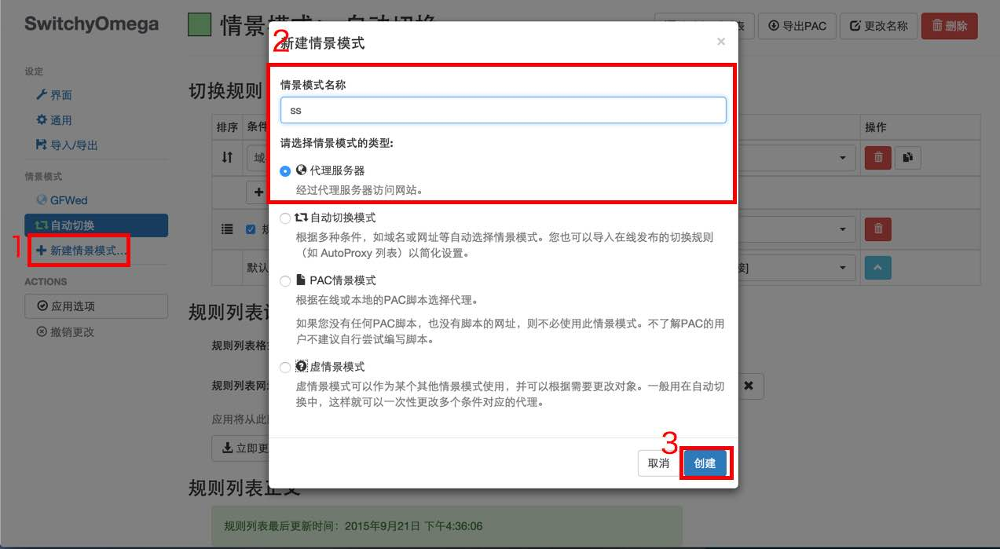
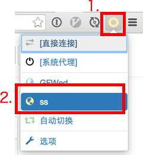

#安装 Shadowsocks Client

## Shadowsocks 原理
在配置安装 Shadowsocks Client 前，首先应该了解一下 Shadowsocks 的[翻墙原理](http://vc2tea.com/whats-shadowsocks/)，这样有利于理解的我们安装过程。

## 安装 Shadowsocks Client
通过原理我们了解到， Shadowsocks 的客户端主要的部分在于 SS Local。而SS Local 的实质就是一个本地运行的服务器，它接受我们的请求，并与远程的 SS Server 交互，同时接受 SS Server 返回的结果，并交给客户端。所以 SS Local 就是一个代理服务器。我们在安装好 SS Local 之后，只要给我们需要翻墙的软件设置代理服务器就可以了。

###获取 SS Local

Shadowsocks 这个程序本身没有分成 Server 和 Client 两部分来开发，两个部分的功能都集中在一个项目里面。我们要用到 Server 的功能还是 Client 的功能，只是由我们使用的命令决定。

所以我们的任务就是安装 Shadowsocks。我们这里选择 Python 版本来进行安装。

+ 安装
	+ [Linux 和 Windows](https://github.com/shadowsocks/shadowsocks/wiki/Shadowsocks-%E4%BD%BF%E7%94%A8%E8%AF%B4%E6%98%8E)
	+ Mac
		1. 下载安装 [Homebrew ](http://brew.sh/index_zh-cn.html)
		2. 安装 python:
			`brew install python`
		3. Homebrew 在安装 python 的时候，安装了 pip，我们通过 pip 来安装 Shadowsocks: `pip install shadowsocks`

+ 开启 SS Local

安装成功后，Shadowsocks 给我们提供了一个 `sslocal` 的命令，这个就是用来启动 SS Local 服务器的。和所有服务器一样，在启动之前我们需要对它进行一下配置。我们使用的配置文件如下：
```
{
    "server": "192.x.x.x",
    "server_port": 443,
    "local_address": "127.0.0.1",
    "local_port":1080,
    "password":"xxx",
    "timeout":360,
    "method":"aes-256-cfb",
    "fast_open": true
}
```
这里的 server 和 server_port 就是 SS Server 的 IP 地址和端口，local_address 和 local_port 就是配置的 SS Local 的 IP 地址和端口。password 就是访问 SS Server 的密码，method 是使用的加密方式。

我们用以上的配置文件内容创建一个 JSON 文件 `config.json`，然后在命令行通过 `sslocal -c config.json` 来根据配置启动 SS Local。

通过以上步骤，我们就开启了本地 SS Local 了。

###安装代理软件
安装好 SS Local 之后，我们需要代理软件将我们的请求都发送到 SS Local 上。

+ 浏览器上的代理软件

由于我们课程推荐使用 chrome 浏览器，所以我们介绍使用 chrome 上的一个插件 SwitchyOmega 。由于未翻墙的情况下不能访问 chrome 的应用商店，所以你可以从这里[下载](http://pan.baidu.com/s/1jGCPoR8)。

下载了上面的文件之后，打开 chrome 浏览器，在地址栏输入 `chrome://extensions/`，然后将上述文件拖入 chrome 浏览器，并根据提示点击“确认”按钮完成安装。

安装完成之后，我们需要对代理软件进行配置，让他知道我们的 SS Local 服务器。

1. 创建新情景模式

2. 设置代理服务器信息

3. 设置进行开始代理


通过以上设置操作之后，我们浏览器的所有请求都通过 SS Local 服务进行访问了。所以每次开机之后记得开启 SS Local。

有的同学会发现设置了 SS Local 之后有时候访问国内网站可能会比较慢，这是因为 SS Local 的请求都会通过 SS Server 来得到最终结果，而 SS Server 一般配置在国外的服务器上，我们访问国内我网站，数据也会到国外去逛一圈，所以有时候速度不是很快。所以可不可以在访问国内网站的时候不通过 SS Local 呢。这样肯定是可以的。

你可以通过[这个教程](https://github.com/FelisCatus/SwitchyOmega/wiki/GFWList)对SwitchyOmega进行配置。配置之后访问 google 等的请求是通过 SS Local，而访问国内网站是直接进行访问的。

+ 命令行软件

注意，我们上面的配置都是对浏览器进行配置，也就是说只有浏览器才能够访问 SS Local 。但是如果我们想让 curl 或者 git 工具使用代理，那怎么办呢？

这里我们使用 proxychains 这个工具。

	1. 安装
		+  Debian/Ubuntu: `apt-get install proxychains`
		+ Mac OS X: `brew install proxychains-ng`
	2. 配置	
		我们在创建配置文件 `~/.proxychains/proxychains.conf`，内容如下：		

				strict_chain
				proxy_dns 
				remote_dns_subnet 224
				tcp_read_time_out 15000
				tcp_connect_time_out 8000
				localnet 127.0.0.0/255.0.0.0
				quiet_mode

				[ProxyList]
				socks5  127.0.0.1 1080
				
		配置之后，我们就可以像如下一样使用代理了：

		proxychains4 curl https://www.twitter.com/
		proxychains4 git push origin master


